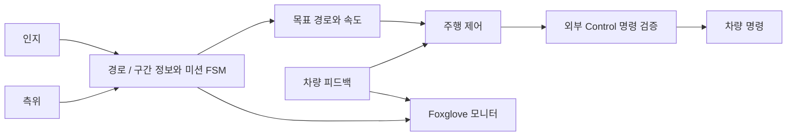
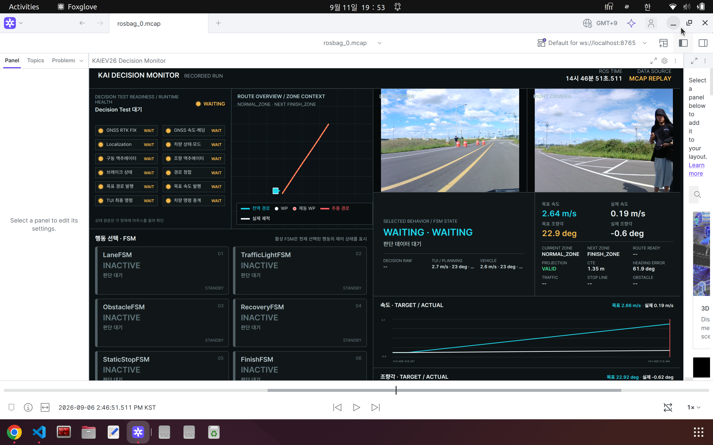

# 주행 판단과 차량 제어 — Team K.A.I.

**2026 대학생 AI·SW 모빌리티 경진대회 · ROS 2 Humble**

[English](README.md) · [프로젝트 포트폴리오](https://steveandy-sudo.github.io/projects/ai-sw-mobility/)

자율주행 경진대회 차량을 위한 경로 기반 판단, 경로 추종, 라바콘 제동 검차 프로젝트입니다. 판단 파이프라인, 차량 명령 생성, AEB 시험과 실시간·기록 데이터 분석용 Foxglove 도구를 함께 정리했습니다.

| 기간 | 역할 | 팀 | 환경 |
| --- | --- | --- | --- |
| 2026년 3월–진행 중 | 황정헌 — 판단 | 전체 27명, 판단 파트 5명 | ROS 2 Humble · Gazebo · Foxglove |

## 주요 개발 영역

판단, 경로 추종, AEB 통합과 검증을 중심으로 작업했습니다.

- **AEB:** 라바콘 경계 기반 중앙 경로 생성, 빨간 진입선 정지 로직, 입력 누락·지연 상태 처리.
- **경로 추종:** Stanley 제어, 조향 제한, 추종 출력과 차량 명령의 연동.
- **통합과 디버깅:** Gazebo 폐루프 시험과 Foxglove를 이용한 경로·조향·정지 상태 확인.
- **실차 시험:** 초기 저속 시험과 조향 응답 문제 분석.

## 현재 진행 상황

Gazebo 폐루프 검증과 약 **7 km/h의 초기 실차 시험**을 진행했습니다. 시험 중 관찰된 조향 흔들림과 관련해 제어 파트에서 스티어링 모터의 지연시간 문제를 확인하고 수정했습니다. **수정 이후 판단 코드를 연결한 실차 재시험은 아직 진행하지 않았으며, 다음 단계는 통합 상태에서의 재검증입니다.**

현재 코드에는 카메라·LiDAR 퓨전과 카메라 단독 인지에 Pure Pursuit 또는 Stanley를 조합한 AEB 시나리오 4종이 포함되어 있습니다. 각 조합의 실측 결과는 시험 조건과 함께 별도로 기록합니다.

## 시스템 흐름



라바콘 AEB는 별도의 인지·추종 진입점을 사용하며 일반 주행 판단과 구분해 실행합니다. 주행 시험에서는 터미널 인터페이스가 출발·AUTO 조건을 확인한 뒤 원시 제어 명령을 `/planning/command`로 전달합니다.

## 핵심 코드 안내

| 영역 | 구현 진입점 |
| --- | --- |
| 경로와 미션 판단 | [Route·Zone 관리](kaiev26_decision/kaiev26_decision/route_zone_manager_node.py) · [판단 엔진](kaiev26_decision/kaiev26_decision/main_planning_engine_node.py) · [미션 FSM](kaiev26_decision/kaiev26_decision/scenario_modules/) |
| 경로 추종·속도 제어 | [Motion Control](kaiev26_motion_control/kaiev26_motion_control/motion_control_node.py) · [설정값](kaiev26_motion_control/config/motion_control.yaml) |
| 라바콘 인지·경로 생성 | [경로 기하](kaiev26_aeb/kaiev26_aeb/core.py) · [카메라 단독 기하](kaiev26_aeb/kaiev26_aeb/yolo_core.py) |
| 라바콘 추종·제동 | [Pure Pursuit·정지 로직](kaiev26_aeb/kaiev26_aeb/pursuit.py) · [Stanley](kaiev26_aeb/kaiev26_aeb/stanley.py) · [시험 조합](kaiev26_aeb/kaiev26_aeb/trial_profiles.py) |
| 시험 운용 | [판단 시험 인터페이스](kaiev26_decision/kaiev26_decision/test_tui.py) · [AEB 시험 인터페이스](kaiev26_aeb/kaiev26_aeb/trial_tui.py) |
| 시각화 | [Foxglove 패키지](kaiev26_decision_fox/README.md) · [사용자 패널](kaiev26_decision_fox/foxglove/src/) |

## 기록 데이터 분석 화면



*원본에 포함된 기록 데이터 재생 화면입니다. 카메라 영상, 경로 정보, 미션 상태와 차량 신호를 한 화면에서 확인합니다.*

## 저장소 구조

```text
kaiev26_decision/         경로·구간 판단, 미션 FSM, 시험 인터페이스
kaiev26_motion_control/   경로 추종, 속도 제어, 차량 명령 생성
kaiev26_aeb/              라바콘 인지, 추종과 제동 검차
kaiev26_decision_fox/     Foxglove 연동 도구와 사용자 패널
docs/                    구조, 운용, 실험과 소스 기록
```

선택한 개발 버전의 패키지 배치를 유지해 실행 파일과 상세 운용 문서가 함께 연결되도록 구성했습니다.

## 문서와 재현 환경

- [환경 구성과 검증 범위](docs/PORTFOLIO_SETUP.md)
- [시스템 구조](docs/ARCHITECTURE.md) · [경로 추종](docs/ROUTE_TRACKING.md) · [설정값](docs/PARAMETER_BOOK.md)
- [운용 가이드](docs/DECISION_RUNBOOK.md) · [미션 시나리오](docs/MISSION_SCENARIOS.md)
- [실험 상태와 다음 통합 시험](docs/EXPERIMENTS.md)
- [이번 수집본의 검증 기록](docs/VALIDATION.md)
- [소스 버전과 파일 기록](docs/SOURCE_MAP.md)

실행에는 각 시험에 맞는 외부 팀 메시지, Control, Localization, 센서와 시뮬레이션 패키지가 필요합니다. 소스 일치, Python 문법, ROS 패키지 XML 검사와 **기존 오프라인 AEB 테스트 29개**를 통과했습니다. ROS 통합 실행과 실차 시험 상태는 검증 기록에서 별도로 설명합니다.
