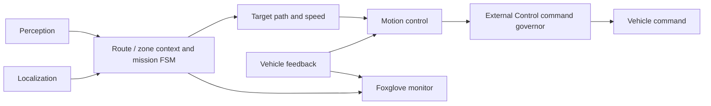

# Decision-Making and Vehicle Control — Team K.A.I.

**2026 Student AI·SW Mobility Competition · ROS 2 Humble**

[한국어](README.ko.md) · [Project portfolio](https://steveandy-sudo.github.io/projects/ai-sw-mobility/)

This project connects route-based driving decisions, path tracking, and cone-course braking for an autonomous competition vehicle. The repository brings together the decision pipeline, vehicle-command generation, AEB trials, and the Foxglove tools used to inspect live and recorded runs.

| Period | Role | Team | Environment |
| --- | --- | --- | --- |
| March 2026–ongoing | Junghun Hwang — Decision-making | 27 members; decision-making team of 5 | ROS 2 Humble · Gazebo · Foxglove |

## Development focus

My work focuses on decision-making, path tracking, AEB integration, and validation:

- **AEB:** cone-boundary center-path generation, red-entry stop logic, and handling of missing or stale inputs.
- **Path tracking:** Stanley control, steering constraints, and the integration of tracking outputs with vehicle commands.
- **Integration and debugging:** Gazebo closed-loop testing and Foxglove inspection of paths, steering, and stop states.
- **Vehicle testing:** initial low-speed trials and investigation of steering-response behavior.

## Current progress

Gazebo closed-loop validation and initial vehicle tests at approximately **7 km/h** have been reported. Following the steering oscillation observed during those trials, the control team identified and corrected a steering-motor delay issue. **The decision stack has not yet been rerun with that correction; integrated vehicle validation is the next step.**

The source snapshot includes four AEB configurations: camera–LiDAR fusion or camera-only perception, each paired with Pure Pursuit or Stanley tracking. These are available implementations; their presence does not establish measured performance for every configuration.

## System overview



The cone-course AEB pipeline has its own perception and tracking entry points. It is operated separately from the main driving pipeline. In the driving test workflow, the terminal interface gates the raw command before forwarding it to `/planning/command`.

## Where to read the code

| Area | Implementation entry points |
| --- | --- |
| Route and mission decisions | [Route/zone manager](kaiev26_decision/kaiev26_decision/route_zone_manager_node.py) · [Planning engine](kaiev26_decision/kaiev26_decision/main_planning_engine_node.py) · [Mission FSMs](kaiev26_decision/kaiev26_decision/scenario_modules/) |
| Path tracking and speed control | [Motion control](kaiev26_motion_control/kaiev26_motion_control/motion_control_node.py) · [Parameters](kaiev26_motion_control/config/motion_control.yaml) |
| Cone perception and path generation | [Corridor geometry](kaiev26_aeb/kaiev26_aeb/core.py) · [Camera-only geometry](kaiev26_aeb/kaiev26_aeb/yolo_core.py) |
| Cone tracking and braking | [Pure Pursuit and stop logic](kaiev26_aeb/kaiev26_aeb/pursuit.py) · [Stanley](kaiev26_aeb/kaiev26_aeb/stanley.py) · [Trial configurations](kaiev26_aeb/kaiev26_aeb/trial_profiles.py) |
| Trial operation | [Decision test interface](kaiev26_decision/kaiev26_decision/test_tui.py) · [AEB test interface](kaiev26_aeb/kaiev26_aeb/trial_tui.py) |
| Visualization | [Foxglove package](kaiev26_decision_fox/README.md) · [Custom panel](kaiev26_decision_fox/foxglove/src/) |

## Inspecting recorded runs


*A recorded-run view included in the source snapshot. The panel brings camera images, route context, mission states, and vehicle signals into one inspection view.*

## Repository structure

```text
kaiev26_decision/         Route and zone logic, mission FSMs, trial interface
kaiev26_motion_control/   Path tracking, speed control, command generation
kaiev26_aeb/              Cone perception, tracking, braking trials
kaiev26_decision_fox/     Foxglove bridge tools and custom panel
docs/                    Architecture, operation, experiments, source records
```

The package layout is preserved from the selected development snapshot so its launch files and operating documentation remain together.

## Documentation and reproducibility

- [Setup and validation scope](docs/PORTFOLIO_SETUP.md)
- [Architecture](docs/ARCHITECTURE.md) · [Route tracking](docs/ROUTE_TRACKING.md) · [Parameters](docs/PARAMETER_BOOK.md)
- [Operating runbook](docs/DECISION_RUNBOOK.md) · [Mission scenarios](docs/MISSION_SCENARIOS.md)
- [Experiment status and next integration test](docs/EXPERIMENTS.md)
- [Checks performed on this collection](docs/VALIDATION.md)
- [Source snapshot and file manifest](docs/SOURCE_MAP.md)

Execution requires the external team message, Control, Localization, sensor, and simulation packages appropriate to the selected workflow. The collection has passed source-integrity checks, Python syntax checks, ROS package XML parsing, and **29 existing offline AEB tests**. ROS integration and vehicle validation are separate checks described in the validation record.
