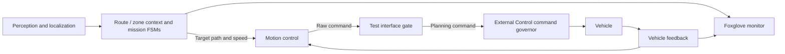

# Decision-Making and Vehicle Control — Team K.A.I.

**2026 Student AI·SW Mobility Competition · ROS 2 Humble**

[한국어](README.ko.md) · [Project portfolio](https://steveandy-sudo.github.io/projects/ai-sw-mobility/) · [Code guide](#code-guide) · [Setup](docs/PORTFOLIO_SETUP.md)

Route-based driving decisions, path tracking, and cone-course braking for an autonomous competition vehicle. This repository connects the implementations to the tools used to inspect mission states, target paths, steering commands, and vehicle feedback.

| Period | Role | Team | Environment |
| --- | --- | --- | --- |
| March 2026–ongoing | Junghun Hwang — Decision-making | 27 members; decision-making team of 5 | ROS 2 Humble · Gazebo · Foxglove |

## Results and current status

| Setting | Available evidence | Current conclusion |
| --- | --- | --- |
| Gazebo | Reported closed-loop AEB trials | Pipeline integration exercised in simulation |
| Initial vehicle trials | Approximately **7 km/h**, with steering oscillation observed | Steering response became the next integration issue |
| Control-side correction | Steering-motor delay identified and corrected by the control team | **Decision-stack retest pending** |
| Offline controller checks | [29 existing AEB tests passed](docs/VALIDATION.md) during repository preparation | Geometry, braking logic, trial profiles, and package layout checked |

The next experiment is to rerun the decision stack with the corrected steering system and compare commanded steering, measured steering, and path error under fixed conditions. The [experiment record](docs/EXPERIMENTS.md) defines what to collect; no post-correction vehicle result is available yet.

## Development focus

- **Driving decisions:** route and zone context, mission-state handling, and target path/speed interfaces.
- **Path tracking:** Stanley control, steering bounds and rate limits, and integration with vehicle-command handling.
- **Cone-course AEB:** cone-boundary center paths, red-entry stop logic, and missing/stale-input handling.
- **Integration and observation:** Gazebo trials, initial vehicle testing, and Foxglove inspection of recorded and live signals.

## System architecture

The main driving test workflow is:


```mermaid
flowchart LR
    Inputs[Perception and localization] --> Decision[Route / zone context and mission FSMs]
    Decision -->|Target path and speed| Motion[Motion control]
    Feedback[Vehicle feedback] --> Motion
    Motion -->|Raw command| TUI[Test interface gate]
    TUI -->|Planning command| Governor[External Control command governor]
    Governor --> Vehicle[Vehicle]
    Vehicle --> Feedback
    Decision --> Monitor[Foxglove monitor]
    Feedback --> Monitor
```

In this workflow, the test interface receives `/decision/raw_command` and owns publication to `/planning/command`. The cone-course AEB package has a separate trial workflow. It provides camera–LiDAR fusion and camera-only perception, each paired with Pure Pursuit or Stanley tracking.

### Design choices visible in the code

| Choice | Implementation | Evaluation relevance |
| --- | --- | --- |
| Separate mission logic from tracking | Mission FSMs produce target path/speed; motion control produces steering and speed commands | State selection and tracking response can be inspected separately |
| Bound steering magnitude and change | Controller outputs pass through angle and rate constraints | Geometric commands must be compared with actuator response |
| Brake on unusable AEB inputs | Stale state/path, invalid geometry, or wrong path frame requests zero speed and braking | Input failures have explicit reasons in the output |
| Confirm and retain the red entry gate | Repeated observations confirm a gate; motion compensation updates it; crossing latches braking | A later cone row cannot silently replace the confirmed stop gate |

The braking branch retains the last limited steering command while requesting a stop. These are implementation properties; measured stopping distance and tracking accuracy require logged trials.

## Code guide

| Area | Start here |
| --- | --- |
| Route and mission decisions | [Route/zone manager](kaiev26_decision/kaiev26_decision/route_zone_manager_node.py) · [Planning engine](kaiev26_decision/kaiev26_decision/main_planning_engine_node.py) · [Mission FSMs](kaiev26_decision/kaiev26_decision/scenario_modules/) |
| Path tracking | [Motion controller](kaiev26_motion_control/kaiev26_motion_control/motion_control_node.py) · [Configuration](kaiev26_motion_control/config/motion_control.yaml) |
| Cone geometry | [Fusion geometry](kaiev26_aeb/kaiev26_aeb/core.py) · [Camera-only geometry](kaiev26_aeb/kaiev26_aeb/yolo_core.py) |
| AEB tracking and stops | [Pure Pursuit / input checks / red stop](kaiev26_aeb/kaiev26_aeb/pursuit.py) · [Stanley](kaiev26_aeb/kaiev26_aeb/stanley.py) · [Trial profiles](kaiev26_aeb/kaiev26_aeb/trial_profiles.py) |
| Trial operation and monitoring | [Decision test interface](kaiev26_decision/kaiev26_decision/test_tui.py) · [AEB test interface](kaiev26_aeb/kaiev26_aeb/trial_tui.py) · [Foxglove package](kaiev26_decision_fox/README.md) |

## Recorded-run inspection


*Existing MCAP replay view: route context, camera input, state readiness, and target/actual signals in one monitor. This frame shows the interface in a waiting state; its instantaneous readouts are not a completed-run performance summary.*

## Build and documentation

Use Ubuntu 22.04 / ROS 2 Humble and the matching team workspace, including `kaiev26_msgs`, Control, Localization, perception, and the sensor/simulator dependencies for the selected workflow. Camera-based AEB requires external model weights. Place this repository at `~/KAI_ws/src/Decision`, then:

```bash
cd ~/KAI_ws
source /opt/ros/humble/setup.bash
colcon build --symlink-install --packages-select \
  kaiev26_decision kaiev26_motion_control kaiev26_decision_fox kaiev26_aeb
source install/setup.bash
```

This is the intended ROS build workflow. Preparation checks were offline; the full ROS build and integrated vehicle run require the team environment.

- **Run or inspect:** [Setup](docs/PORTFOLIO_SETUP.md) · [Runbook](docs/DECISION_RUNBOOK.md) · [Mission scenarios](docs/MISSION_SCENARIOS.md)
- **Understand the design:** [Architecture](docs/ARCHITECTURE.md) · [Route tracking](docs/ROUTE_TRACKING.md) · [Parameters](docs/PARAMETER_BOOK.md)
- **Trace the evidence:** [Experiments](docs/EXPERIMENTS.md) · [Validation](docs/VALIDATION.md) · [Source snapshot](docs/SOURCE_MAP.md)