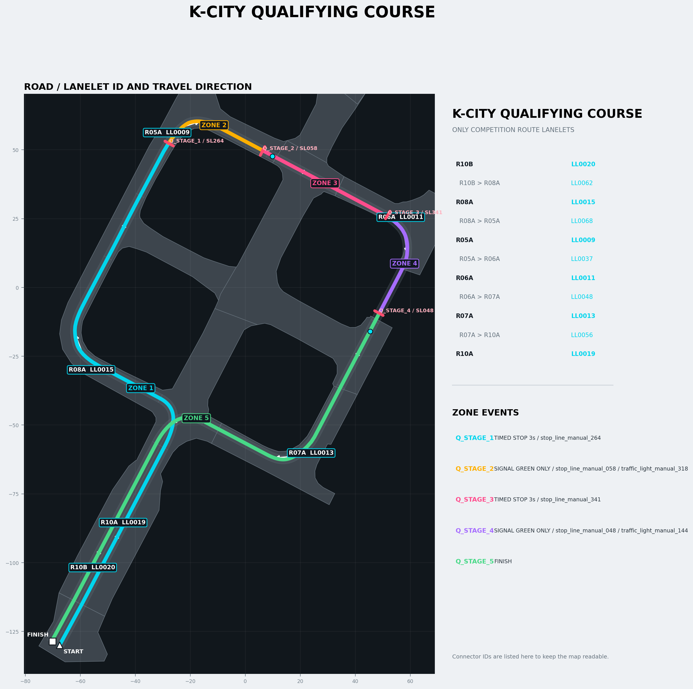
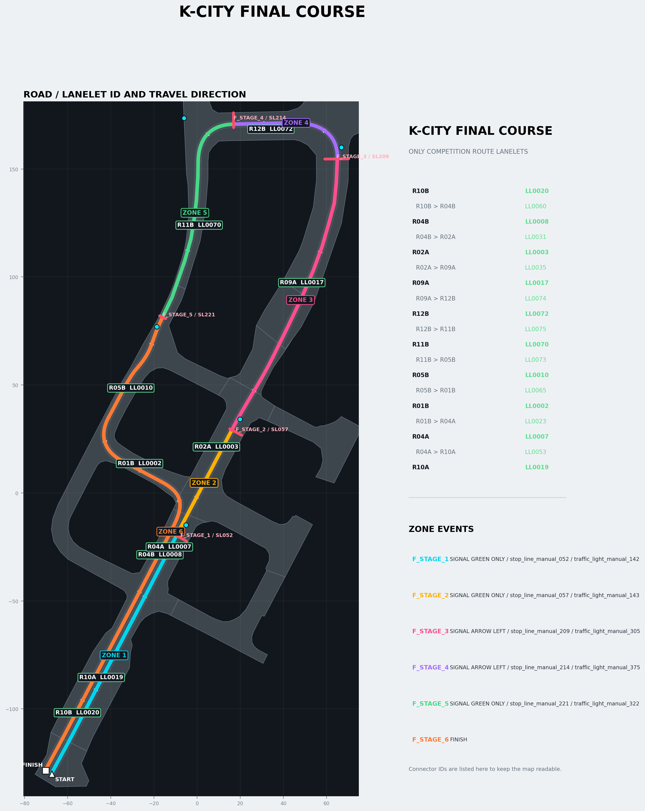

# Mission Scenarios

예선·본선의 Stage, Event, 신호와 제동 waypoint를 정리한다. 기준 파일은
`kaiev26_decision/config/*_policy.yaml`이다.

## Event

| Event | 동작 |
|---|---|
| `TIMED_STOP` | 지정 지점 정지, 실제 정지 확인, 3초 후 재출발 |
| `SIGNAL_OBEY` | 지정 신호에 따라 정지 또는 전역경로 진행 |
| `FINISH` | 종료점 감속·정지 |

현재 Stage에 등록되지 않은 신호와 정지선은 무시한다. 완료 Event는 같은 Run에서 다시
실행하지 않는다.

## 예선



```text
R10B -> R08A -> R05A -> R06A -> R07A -> R10A
```

| Stage | 제동 WP | Event | 대상 | 동작 |
|---|---:|---|---|---|
| `Q_STAGE_1` | `203` | `TIMED_STOP` | 정지선 `264` | 3초 정지 |
| `Q_STAGE_2` | `244` | `SIGNAL_OBEY` | 정지선 `058`, 신호 `318` | 직진 신호 판단 |
| `Q_STAGE_3` | `296` | `TIMED_STOP` | 정지선 `341` | 3초 정지 |
| `Q_STAGE_4` | `337` | `SIGNAL_OBEY` | 정지선 `048`, 신호 `144` | 직진 신호 판단 |
| `Q_STAGE_5` | - | `FINISH` | WP `515` | 완주 정지 |

## 본선



```text
R10B -> R04B -> R02A -> R09A -> R12B
     -> R11B -> R05B -> R01B -> R04A -> R10A
```

| Stage | 제동 WP | 정지선 / 신호 | 허용 진행 |
|---|---:|---|---|
| `F_STAGE_1` | `98` | `052 / 142` | 직진 |
| `F_STAGE_2` | `153` | `057 / 143` | 직진 |
| `F_STAGE_3` | `289` | `209 / 305` | 좌회전 |
| `F_STAGE_4` | `346` | `214 / 375` | 좌회전 |
| `F_STAGE_5` | `448` | `221 / 322` | 직진 |
| `F_STAGE_6` | - | 종료 구간 | 회피 후 완주 |

## 시험 Case

| Case | 코스 | 기능 |
|---:|---|---|
| `1` | 예선 | 경로 추종 |
| `2` | 예선 | 경로 추종 + 모든 정지점 3초 정지 |
| `3` | 예선 | 실제 예선 미션 전체 |
| `4` | 본선 | 경로 추종 |
| `5` | 본선 | 경로 추종 + 모든 정지점 3초 정지 |
| `6` | 본선 | 경로 추종 + 장애물 회피 |
| `7` | 본선 | 실제 본선 미션 전체 |
| `8` | 없음 | 상수 속도 + R/L 조향 스텝 |

Case `2·5`는 신호를 무시하고 모든 등록 지점을 `TIMED_STOP`으로 실행한다.

## 신호 판단

| 입력 | 직진 Stage | 좌회전 Stage |
|---|---|---|
| `GREEN` | 진행 | 진행 |
| `GREEN+ARROW` | 진행 | 진행 |
| `RED` | 정지 | 정지 |
| `YELLOW` | 정지 원칙 | 정지 원칙 |
| `RED+ARROW`, `ARROW` | 정지 | 좌회전 진행 |
| `UNKNOWN` | 정지 | 정지 |

화살표 진행은 전역경로 maneuver와 Policy가 모두 `LEFT`일 때만 허용한다. 이미 강제제동을
시작했다면 실제 정지 후 진행 신호를 0.4초 확인하고 재출발한다.

## 정지 시퀀스

```text
Event 인지 시작: 제동 WP 30 m 전
  -> WP 6 m 전부터 2.0 m/s 방향으로 감속
  -> WP 도달: speed=0, brake_engage=true
  -> 실제속도 <= 0.1 m/s 확인
  -> 3초 대기 또는 진행 신호 대기
  -> 브레이크 해제, 경로 추종 재개
```

고속 주행 전에는 실제 제동거리로 6 m 감속 구간과 제동 WP를 다시 검증한다.

## 변경 위치

| 변경 대상 | 파일 |
|---|---|
| 전역경로·종료점 | `waypoints/kcity_*_route.yaml` |
| 정지선·신호 위치 | `config/*_landmarks.yaml` |
| Stage·Event·제동 WP | `config/*_policy.yaml` |
| 감속·정지 수치 | `config/decision_pipeline.yaml` |

라바콘 검차는 별도 [`kaiev26_aeb`](../kaiev26_aeb/README.md)를 사용한다.
